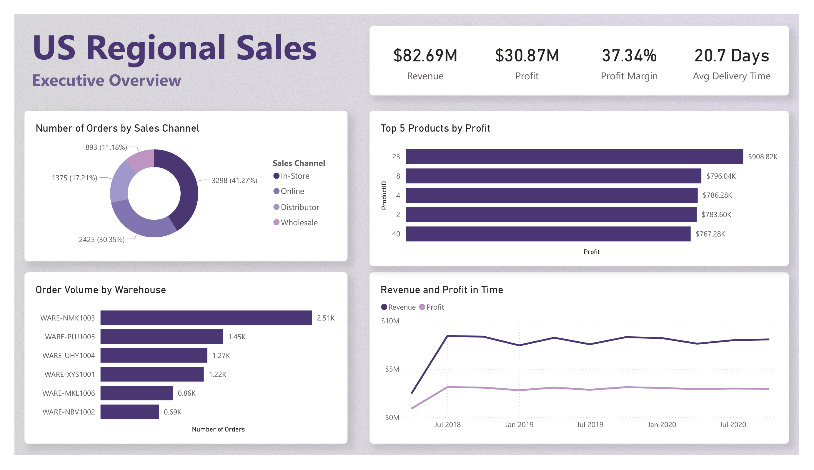
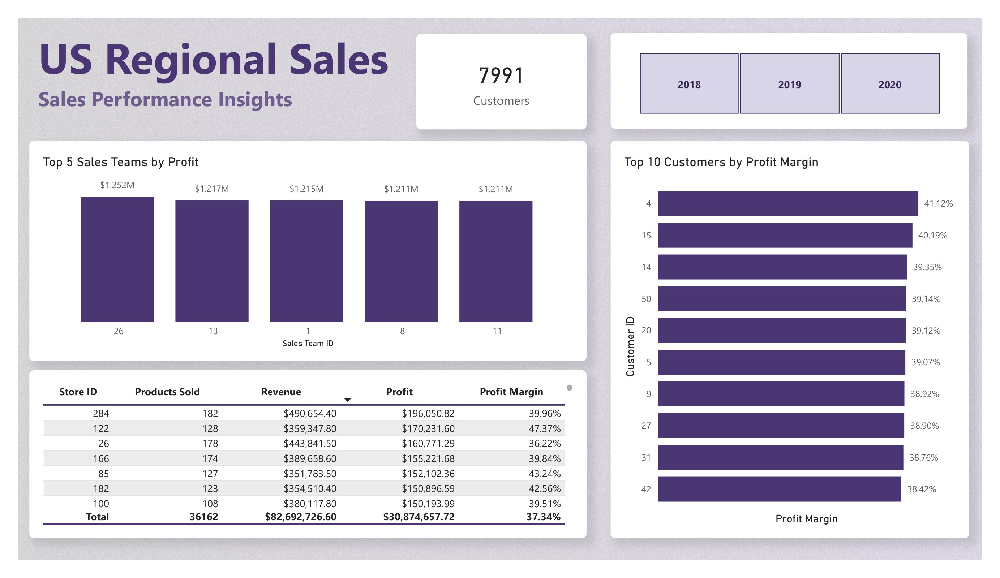

# US Regional Sales Dashboard – Power BI

A 2-page interactive Power BI dashboard analyzing sales performance, channel distribution, warehouse volume, and store profitability across 2018-2020.

Built as a personal portfolio project using a sample Kaggle dataset (~8,000 rows).

## 📊 Dashboard Pages

### Page 1 – Executive Overview
Summary of overall business performance.

---

### Page 2 – Sales Performance Insights
Deeper analysis of teams, stores, and customers.

## 💡 Key Insights
- In-Store dominates sales channels with 41% of total orders.
- Average Delivery Time of 20.7 days suggests potential supply chain inefficiencies worth investigating at warehouse level.
- Team 26 leads in profit ($1.252M), but the remaining top 4 teams perform at a similar level ($1.211M–$1.217M), indicating consistent performance across the top tier.

## 🔨 Tools & Technologies
Power BI Desktop · DAX · Kaggle

## ℹ️ Dataset

**Source:** Kaggle – US Regional Sales Data [[Link]](https://www.kaggle.com/datasets/dorothyjoel/us-regional-sales)  
**Size:** ~8,000 rows  

> *Note: the dataset lacks dimensional data (product names, team descriptions, customer names), limiting the analysis to a technical level.*
